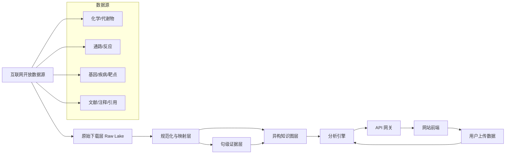
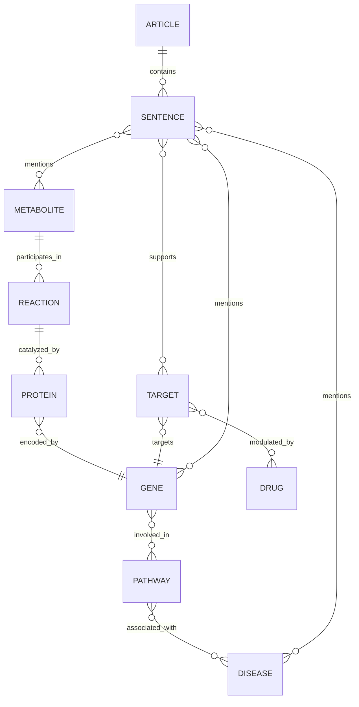
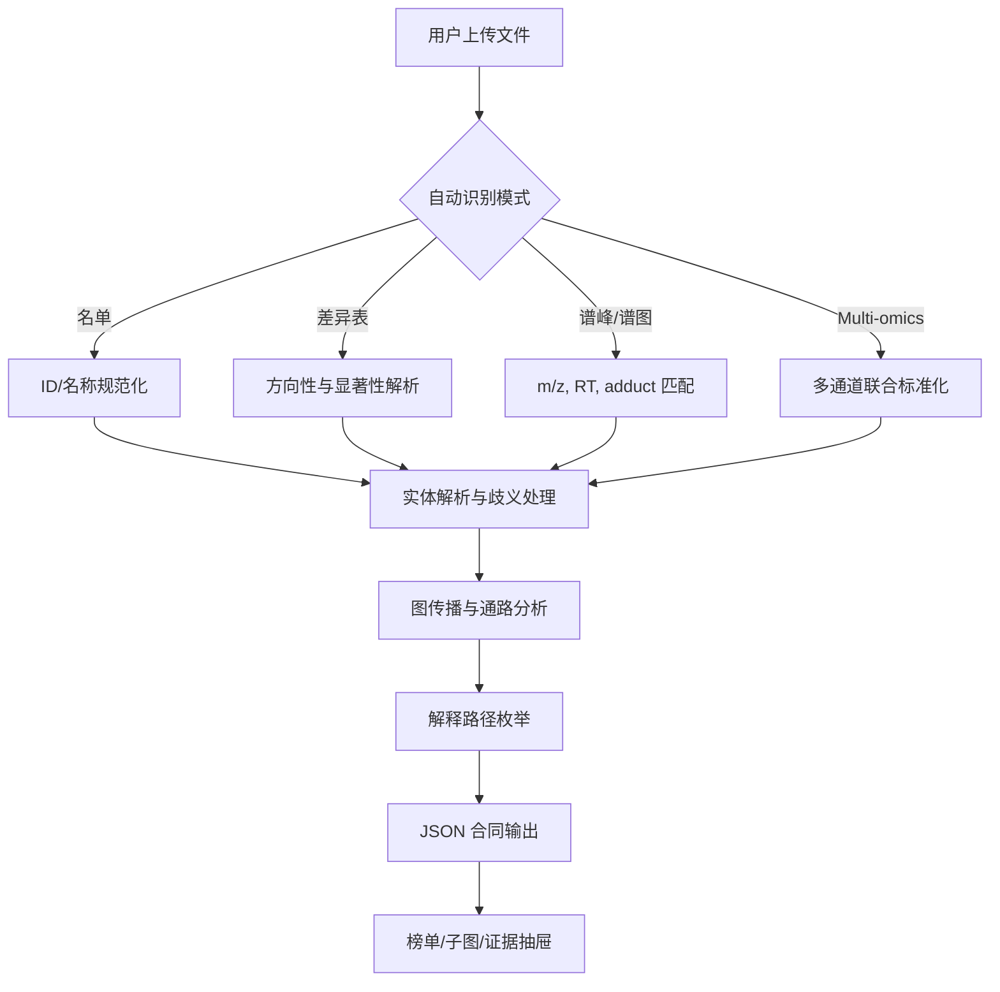
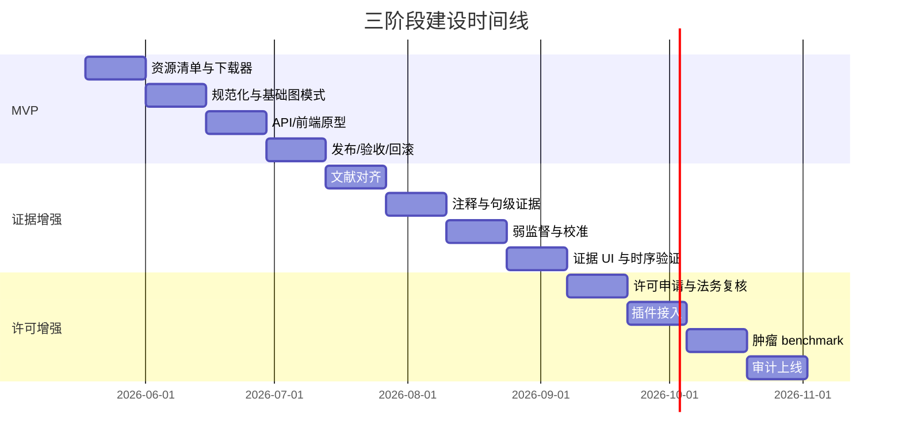

# 面向对外网站化的确定性可审计代谢物知识库建设报告草案

## 执行摘要

本项目适合建设为一个**无 RAG、版本化、可审计、可解释**的代谢知识引擎，而不是检索式问答系统：底层以可批量下载的开放数据源为主，构建“代谢物—反应—基因/蛋白—通路—疾病—治疗靶点—文献证据”的异构知识图；中间层用确定性实体规范化、可校准关系评分、类型约束图传播和最短解释路径实现分析；上层通过结构化 JSON 合同和证据回链输出给网站前端。开放底座建议优先使用 urlChEBIturn7view2、urlPubChem 下载说明https://pubchem.ncbi.nlm.nih.gov/docs/downloads、urlBridgeDb 映射库turn26view2、urlLIPID MAPSturn39view0、urlReactome 下载页turn23view0、urlWikiPathways 当前数据下载turn38view2、urlEnsembl 数据访问说明turn36view1、urlNCBI Gene 下载说明turn36view3、urlOpen Targets 数据集下载turn7view5、urlMONDO 下载页turn27view0、urlDisease Ontology 下载页turn7view6、urlMeSH 数据下载页turn7view7、urlPubMed 数据下载说明turn7view8、urlPubTator Centralhttps://www.ncbi.nlm.nih.gov/CBBresearch/Lu/Demo/PubTatorCentral/、urlEurope PMC 下载页turn6search3、urlPMC FTP 服务说明turn20view3、urliCite APIturn29view0；后期再按许可引入 urlHMDB 下载页turn7view0、urlKEGG 法律与许可页https://www.kegg.jp/kegg/legal.html、urlDisGeNET 下载页https://www.disgenet.com/downloads 和 urlGDC API 说明turn31search5 对应的许可增强模块。整体建议分三阶段推进：开放底座 MVP、文献证据增强、许可增强；每次发布都生成不可变的 release manifest，并以回归测试、时序验证和消融实验作为上线门槛。citeturn7view2turn26view2turn39view0turn23view0turn38view2turn36view1turn36view3turn7view5turn27view0turn7view6turn7view7turn7view8turn6search3turn20view3turn29view0turn31search5

## 系统范围与总体架构

本系统的目标不是替代实验或临床判断，而是提供一个**对外网站可用的研究级知识基础设施**：既能检索规范实体和跨库映射，也能对用户上传的代谢物名单、差异表、谱峰/谱图和 multi-omics 数据做自动解析，并返回**可追溯证据、可解释路径、可重放版本**的分析结果。这里的“无 RAG”并不意味着不用 AI，而是意味着**AI 不参与事实召回与主评分**；模型只能服务于句级关系抽取、摘要重述或前端解释压缩，而所有主评分必须由可复现公式、固定参数和冻结版本模型完成。这样才能满足确定性、可审计和可回滚的要求。citeturn23view3turn22view4turn7view5turn7view8turn29view0

建议把架构拆成四层：原始下载层、规范化关系层、图计算层、网站服务层。原始下载层保存每一个来源文件、许可快照和 checksum；规范化关系层负责实体主键、交叉引用、句级证据和版本字段；图计算层只保留供传播和解释使用的稀疏多层图；网站服务层暴露 `/resolve`、`/analyze`、`/evidence`、`/subgraph`、`/releases` 等端点。官方资源已经同时提供了下载、API 和分析接口，使这种“离线发布 + 在线分析”的分层模式可行；例如 urlReactome 内容 APIturn7view1 和 urlReactome 分析服务turn23view3 适合做通路层对照，urlOpen Targets GraphQL APIturn22view4 适合单对象交互查询，而 urlOpen Targets 数据集下载turn7view5 更适合离线批量构图。citeturn7view1turn23view3turn22view4turn7view5

建议将下面这张图放在“总体架构”章节首页，作为项目成员、前端和算法团队共享的统一蓝图。



自动化与人工审批应明确分离。完全自动化的部分包括：公开数据下载、文件校验、解析、跨库映射、句级证据抽取、图构建、发布打包、回归测试、网站缓存预热。需要人工审批或法务确认的部分包括：urlHMDB 下载页turn7view0 的再分发/商业许可确认、urlKEGG 法律与许可页https://www.kegg.jp/kegg/legal.html 的服务型使用许可、urlDisGeNET 下载页https://www.disgenet.com/downloads 的完整数据库/商业路径、以及 urlGDC 数据访问流程turn31search6 牵涉的受控肿瘤队列审批。citeturn7view0turn31search6

| 类别 | 是否可完全自动化 | 说明 |
|---|---:|---|
| 开放数据下载与校验 | 是 | 通过脚本或调度器按版本抓取并校验 checksum |
| 实体规范化与跨库映射 | 是 | 规则引擎 + 冻结参数 |
| 文献对齐、注释与关系抽取 | 是 | 批量管线，不依赖人工问答/标注 |
| 发布、回滚、回归测试 | 是 | 不可变 release + 自动验收 |
| 公开网站查询与分析 | 是 | 在线只读、结果缓存 |
| 商业/再分发许可确认 | 否 | 需法务或负责人审批 |
| 受控数据访问 | 否 | 需账号、审批、审计流程 |

## 数据源清单与许可路径

建议把数据源分成“开放核心层”和“许可增强层”。开放核心层进入 MVP 主图；许可增强层只做可插拔模块，不作为首发网站的唯一真相源。下表中的“官方入口”均为首选下载或 API 页面，便于后续自动化与审计。

| 资源 | 官方入口 | 主要用途 | 接入方式 | MVP 使用建议 | 许可/服务策略 |
|---|---|---|---|---|---|
| 化学本体 | urlChEBIturn7view2 | 代谢物主键、本体、结构与同义词 | OWL/OBO/SDF/SQL | 是 | 作为开放核心层 |
| 化学补充 | urlPubChem 下载说明https://pubchem.ncbi.nlm.nih.gov/docs/downloads | CID、结构、同义词、性质 | FTP/下载 | 是 | 作为开放核心层 |
| 跨库映射 | urlBridgeDb 映射库turn26view2 | ChEBI/PubChem/HMDB 等映射 | 预构建映射库 | 是 | 作为开放核心层 |
| 脂质专层 | urlLIPID MAPSturn39view0 / urlLIPID MAPS RESTturn39view1 | 脂质分类、结构、谱信息 | 下载 + REST | 是 | 作为开放核心层 |
| 通路/反应 | urlReactome 下载页turn23view0 | 通路、反应、层级结构 | 下载/内容 API | 是 | 作为开放核心层 |
| 通路补充 | urlWikiPathways 当前数据下载turn38view2 / urlWikiPathways JSON APIturn16search4 | 通路补充、跨源对照 | 下载 + Web Service | 是 | 作为开放核心层 |
| 基因主键 | urlEnsembl 数据访问说明turn36view1 / urlEnsembl REST APIturn36view0 | 稳定基因 ID | 下载 + REST | 是 | 作为开放核心层 |
| 基因补充 | urlNCBI Gene 下载说明turn36view3 | GeneID、别名、RefSeq | 下载/CLI | 是 | 作为开放核心层 |
| 疾病本体 | urlMONDO 下载页turn27view0、urlDisease Ontology 下载页turn7view6、urlMeSH 数据下载页turn7view7 | 疾病主键、分层、文献索引 | 下载/RDF | 是 | 作为开放核心层 |
| 靶点/疾病证据 | urlOpen Targets 数据集下载turn7view5 / urlOpen Targets GraphQL APIturn22view4 | 靶点-疾病证据、药物相关性 | Bulk + GraphQL | 是 | 作为开放核心层 |
| 文献元数据 | urlPubMed 数据下载说明turn7view8 | PMID、标题、摘要、期刊、日期 | Baseline + update | 是 | 作为开放核心层 |
| 文献注释 | urlPubTator Centralhttps://www.ncbi.nlm.nih.gov/CBBresearch/Lu/Demo/PubTatorCentral/ | 生物医学实体批量注释 | API/批量 | 是 | 作为开放核心层 |
| 全文与注释 | urlEurope PMC 下载页turn6search3 / urlPMC FTP 服务说明turn20view3 | 可重用全文、开放获取文章 | 下载/FTP/API | 是 | 作为开放核心层 |
| 引用指标 | urliCite APIturn29view0 | RCR、引用数、临床引用 | API/Bulk | 是 | 作为开放核心层 |
| 生物活性/药物 | urlChEMBL 下载页https://chembl.gitbook.io/chembl-interface-documentation/downloads / urlChEMBL Web Serviceshttps://chembl.gitbook.io/chembl-interface-documentation/web-services | 靶点、生物活性、机制 | 下载 + API | 建议第二阶段 | 上线前复核再分发边界 |
| 人类代谢富注释 | urlHMDB 下载页turn7view0 / urlHMDB 关于与许可说明https://hmdb.ca/about | 人体代谢物、疾病、谱图增强 | 下载 | 许可增强 | 商业/再分发前书面复核 |
| 路径补充 | urlKEGG 法律与许可页https://www.kegg.jp/kegg/legal.html | 代谢与通路补充 | API/许可订阅 | 许可增强 | 若做公开服务，先完成许可 |
| 疾病基因证据 | urlDisGeNET 下载页https://www.disgenet.com/downloads | 疾病-基因关系补充 | 下载/订阅 | 许可增强 | 以官网商务路径为准 |
| 肿瘤队列 | urlGDC API 说明turn31search5 / urlGDC 数据访问流程turn31search6 | 肿瘤场景基准与外部验证 | API + Portal | 开放访问部分可用 | 受控部分需审批 |

上表中的开放核心层，论证基础来自各源官方公开的下载/API 页面；其中 urlPubMed 数据下载说明turn7view8 提供基线及日更文件策略，urlReactome 下载页turn23view0 和 urlReactome 内容 APIturn7view1 同时支持离线和在线内容访问，urlOpen Targets 数据集下载turn7view5 与 urlOpen Targets GraphQL APIturn22view4 明确区分了 bulk 和交互式访问，urlPMC FTP 服务说明turn20view3 还特别提示了旧目录迁移到 `deprecated/` 的时间点和后续移除计划，说明下载器必须做目录切换与镜像兜底。citeturn7view8turn23view0turn7view1turn7view5turn22view4turn20view3

下面的命令示例可直接作为自动化下载的起点；建议把每次运行的远端版本号、文件列表和校验值写入发布清单中。相关官方入口见上表。citeturn7view8turn23view0turn7view5turn7view2turn39view1

```bash
# PubMed baseline + daily updates
wget -r -np -nH --cut-dirs=1 -A '*.xml.gz,*.md5' https://ftp.ncbi.nlm.nih.gov/pubmed/baseline/
wget -r -np -nH --cut-dirs=1 -A '*.xml.gz,*.md5' https://ftp.ncbi.nlm.nih.gov/pubmed/updatefiles/

# ChEBI ontology
wget ftp://ftp.ebi.ac.uk/pub/databases/chebi/ontology/chebi.owl

# Reactome version + analysis
curl -X GET 'https://reactome.org/ContentService/data/database/version'
curl -X POST 'https://reactome.org/AnalysisService/identifiers/projection?pageSize=20&page=1' \
  -H 'Content-Type: text/plain' \
  --data-binary @metabolites.txt

# Open Targets bulk
aws s3 sync s3://open-targets-public-data-releases/platform/ ./opentargets/

# LIPID MAPS REST example
curl 'https://www.lipidmaps.org/rest/compound/lm_id/LMFA/all/download' -o lipidmaps_fatty_acyls.tsv

# NCBI Gene / Ensembl 建议走官方 CLI 或定期抓取
datasets download gene taxon human
```

## 数据模型与图谱模式

内部数据模型不应直接把任何外部 ID 当作唯一主键，而应采用“**规范实体 + 外部交叉引用 + 证据边**”三层设计。代谢物建议以 `metabolite_uid` 为内部主键，首选外部锚点是 ChEBI，结构清晰时再挂 PubChem CID、LIPID MAPS、HMDB、KEGG 等交叉引用；基因以 `gene_uid` 为内部主键，首选外部锚点是 Ensembl Gene，再挂 NCBI Gene、RefSeq、UniProt、ChEMBL target xref；疾病以 `disease_uid` 为内部主键，首选 MONDO，并保留 DOID、MeSH、EFO 交叉引用；通路以 Reactome stable ID 为首选外部锚点，补充 WikiPathways、KEGG 路径 xref；文章以 PMID 为首选外部 ID，存在全文时再挂 PMCID。之所以这样设计，是因为 urlOpen Targets 数据集下载turn7view5 的证据对象天然围绕基因/靶点与疾病本体展开，urlEnsembl 数据访问说明turn36view1 和 urlNCBI Gene 下载说明turn36view3 提供稳定的基因主键层，而 urlMONDO 下载页turn27view0、urlDisease Ontology 下载页turn7view6、urlMeSH 数据下载页turn7view7 一起构成疾病统一、层级和文献索引的组合。citeturn7view5turn36view1turn36view3turn27view0turn7view6turn7view7

建议把下图放在“数据模型与图谱模式”章节开头，帮助后端、算法和前端共用同一张实体关系图。



### 规范实体表建议

| 实体 | 内部主键 | 首选外部 ID | 必存字段 | 版本/许可字段 |
|---|---|---|---|---|
| Metabolite | `metabolite_uid` | ChEBI；其次 PubChem CID | `canonical_name, synonyms[], formula, exact_mass, charge, inchikey, smiles, external_xrefs, source_priority` | `source_release, license_id, checksum, parser_hash` |
| Reaction | `reaction_uid` | Reactome reaction stable id | `name, participants, stoichiometry, compartment, species` | 同上 |
| Protein | `protein_uid` | UniProt / Ensembl protein | `symbol, name, species, external_xrefs` | 同上 |
| Gene | `gene_uid` | Ensembl Gene | `symbol, aliases[], taxon, entrez_gene_id, uniprot_ids[]` | 同上 |
| Pathway | `pathway_uid` | Reactome stable id | `name, hierarchy_path, species, external_xrefs` | 同上 |
| Disease | `disease_uid` | MONDO | `name, aliases[], doid, mesh_ids[], efo_ids[], parents[]` | 同上 |
| Target | `target_uid` | Open Targets/ChEMBL target xref | `preferred_name, target_type, gene_uid, tractability_flags` | 同上 |
| Article | `article_uid` | PMID | `pmid, pmcid, doi, title, abstract, journal, pub_date, article_type` | `source_release, license_id, checksum` |
| Sentence | `sentence_uid` | `article_uid + offset_hash` | `section, text_hash, sentence_text, offsets, language` | `parser_hash, model_hash, source_release` |

### 边属性表建议

| 字段 | 含义 | 备注 |
|---|---|---|
| `edge_uid` | 边主键 | 不可变 |
| `subject_uid / object_uid` | 两端节点 | 指向规范实体表 |
| `predicate` | 关系类型 | 如 `participates_in`, `supports_association`, `evidence_for` |
| `source_name` | 来源名 | 例如 Reactome、PubTator、Open Targets |
| `source_record_id` | 外部记录号 | 可回链 |
| `source_release` | 数据源版本 | 必填 |
| `license_id` | 许可标识 | 必填 |
| `evidence_level` | curated / inferred / literature / user | 关系来源类别 |
| `polarity` | up/down/activate/inhibit/none | 支持方向性 |
| `species` | 物种 | 默认人类，可扩展 |
| `context_json` | 癌种、组织、亚型、实验条件 | JSONB |
| `score_components_json` | 各分量得分 | 便于解释 |
| `calibrated_prob` | 校准后概率 | 0–1 |
| `sentence_uid` | 句级证据引用 | 可为空 |
| `model_hash / config_hash` | 模型与参数版本 | 必填 |
| `created_at` | 生成时间 | 审计字段 |

物理存储建议分三层：`raw_lake` 保存原始文件、许可截图和 checksum；`normalized_store` 保存实体、xref、证据与版本表；`graph_projection` 保存供查找、传播和可视化的稀疏图。这样可以在不破坏审计链的前提下重建图谱或替换图数据库实现。

## 确定性算法与文献证据建模

算法目标不是“尽可能聪明”，而是“**尽可能稳定、可解释、可复验**”。建议把主流程拆成四步：实体规范化、关系评分、图传播、解释路径枚举。通路统计层可借鉴 urlReactome 分析服务turn23view3 输出的 `pValue/FDR/coverage` 语义，疾病与靶点证据聚合层可借鉴 urlOpen Targets 数据集下载turn7view5 与 urlOpen Targets GraphQL APIturn22view4 区分 `evidence` 与 `association` 的思路；这样既能与外部体系对齐，又不必把外部实现照搬进来。citeturn23view3turn7view5turn22view4

### 关键公式

**实体匹配分数**

\[
S_{id}(c)=50I_{ext}+30I_{inchikey14}+20I_{name\_exact}+10I_{synonym}+8s_{ppm}+6I_{formula}+4I_{adduct}+3s_{rt}-12p_{ambiguity}
\]

其中：

- \(I_{ext}\)：外部 ID 精确命中  
- \(I_{inchikey14}\)：骨架 InChIKey 命中  
- \(s_{ppm}=max(0,1-|ppm|/ppm_{tol})\)  
- \(s_{rt}\)：保留时间映射分数  
- \(p_{ambiguity}\)：别名冲突惩罚  

推荐判定规则：

- `top1 >= 60`
- `top1 - top2 >= 15`

否则标记为**歧义匹配**，不自动定锤。

**边置信度**

\[
p_{final}(e)=1-(1-p_{curated})(1-p_{literature})(1-p_{topology})(1-p_{user})
\]

其中：

- \(p_{curated}=1-\prod_s(1-r_s)\)：结构化来源先验  
- \(p_{literature}=1-\prod_i(1-q_iw_i)\)：句级关系抽取概率与文章权重叠加  
- \(p_{topology}\)：图结构与多路径一致性得分  
- \(p_{user}\)：用户样本是否支持该关系方向与强度  

**类型约束图传播**

\[
\pi=(1-\alpha)y+\alpha W\pi,\quad \alpha=0.85
\]

其中 \(W\) 为按边类型门控和归一化后的转移矩阵，建议优先允许：

`Metabolite → Reaction → Protein/Gene → Pathway → Disease/Target`

**解释路径代价**

\[
C(path)=\sum_{e \in path} -\log(p_{final}(e))
\]

对长度 2–5 的简单路径求 Top-K 最低代价路径，并只把通过类型约束与证据阈值的路径返回给前端。

### 弱监督与校准策略

你没有人工问答或手工标注，这是可行的，但必须把 40,000 篇 `articles.txt` 用作**弱监督与校准语料**，而不是问答知识库。推荐流程是：先把文献对齐到 PMID/PMCID；再用 urlPubTator Centralhttps://www.ncbi.nlm.nih.gov/CBBresearch/Lu/Demo/PubTatorCentral/ 与 urlEurope PMC 下载页turn6search3 的注释/全文能力生成实体提及；然后用结构化数据库产生远程监督标签：被 Reactome/Open Targets/BridgeDb/LIPID MAPS/ChEMBL 等高置信来源支持的实体对作为**正例**，实体类型相符但被方向规则否定或跨多源均不成立的同句实体对作为**难负例**。句级关系模型可以是冻结的生物医学编码器 + 逻辑回归或 GBDT；模型输出再经 isotonic regression 或 Platt scaling 做概率校准，最终冻结 `model_hash`。文献层只能**增强或提议**关系，不得直接覆盖真相层。citeturn6search3turn29view0turn23view0turn7view5turn39view0turn26view2

**文章权重**建议定量化，而不是让模型“凭感觉”：

\[
w_{article}=w_{studytype}\cdot w_{recency}\cdot w_{impact}\cdot w_{fulltext}\cdot w_{polarity}
\]

其中：

- `w_studytype`：实验研究 > 临床研究 > 综述 > 病例报告  
- `w_recency`：按年份衰减，但保留经典研究的最低权重地板  
- `w_impact`：来自 urliCite APIturn29view0 的 `RCR`、引用数、`cited_by_clin`  
- `w_fulltext`：有开放全文且句段可解析时提高权重  
- `w_polarity`：把支持、反对、无显著关联分开累计而非混加  

40,000 篇 `articles.txt` 的 PMID/PMCID 对齐建议按以下顺序执行：`DOI exact > PMID/标题精确 > 标题+年份+期刊近似匹配 > 未解析队列`。如果最终仍无法稳定对齐，就保留为 `unresolved_article`，后续不得参与参数更新，只能作为人工复核候选。这样才能保证训练集和证据库的身份稳定。citeturn7view8turn6search3turn20view3turn29view0

下面的伪代码建议放在算法章节中，便于研发直接实现。

```python
def resolve_metabolite(record, candidate_set, config):
    scored = []
    for c in candidate_set:
        s = 0
        s += 50 if record.ext_id == c.ext_id else 0
        s += 30 if record.inchikey14 == c.inchikey14 else 0
        s += 20 if record.name == c.canonical_name else 0
        s += 10 if record.name in c.synonyms else 0
        s += 8 * max(0, 1 - abs(record.ppm_error) / config.ppm_tol)
        s += 6 if record.formula == c.formula else 0
        s += 4 if record.adduct == c.adduct else 0
        s += 3 * retention_time_score(record, c)
        s -= 12 * ambiguity_penalty(record, c)
        scored.append((c.uid, s))
    scored.sort(key=lambda x: (-x[1], x[0]))
    top1, top2 = scored[0], scored[1] if len(scored) > 1 else ("NA", -1)
    if top1[1] >= 60 and (top1[1] - top2[1]) >= 15:
        return {"status": "resolved", "uid": top1[0], "score": top1[1]}
    return {"status": "ambiguous", "candidates": scored[:5]}
```

```python
def analyze_upload(input_table, graph, config):
    mode = detect_mode(input_table.columns, input_table.sample_values)
    parsed = parse_by_mode(mode, input_table)
    resolved = [resolve_entity(x, graph.indices, config) for x in parsed.records]
    seeds = [r["uid"] for r in resolved if r["status"] == "resolved"]
    user_support = build_user_support_features(parsed, resolved)
    edge_probs = compute_edge_probabilities(graph.edges, user_support, config)
    ppr_scores = typed_ppr(graph, seeds, alpha=0.85, edge_probs=edge_probs)
    pathways = pathway_enrichment(seeds, graph.pathway_index)
    explanations = k_shortest_explanations(graph, seeds, targets=["pathway","disease","target"])
    return build_contract_json(mode, parsed, resolved, pathways, ppr_scores, explanations, config)
```

### 句级证据 JSON Schema 样例

```json
{
  "$schema": "https://json-schema.org/draft/2020-12/schema",
  "title": "SentenceEvidence",
  "type": "object",
  "required": [
    "sentence_uid", "pmid", "sentence_text", "mentions",
    "relation_candidates", "source_release", "license_id",
    "parser_hash", "model_hash"
  ],
  "properties": {
    "sentence_uid": { "type": "string" },
    "pmid": { "type": "string" },
    "pmcid": { "type": ["string", "null"] },
    "section": { "type": ["string", "null"] },
    "sentence_text": { "type": "string" },
    "text_hash": { "type": "string" },
    "mentions": {
      "type": "array",
      "items": {
        "type": "object",
        "required": ["entity_type", "surface", "start", "end", "normalized_uid"],
        "properties": {
          "entity_type": { "type": "string" },
          "surface": { "type": "string" },
          "start": { "type": "integer" },
          "end": { "type": "integer" },
          "normalized_uid": { "type": ["string", "null"] }
        }
      }
    },
    "relation_candidates": {
      "type": "array",
      "items": {
        "type": "object",
        "required": ["subject_uid", "predicate", "object_uid", "raw_score", "calibrated_prob"],
        "properties": {
          "subject_uid": { "type": "string" },
          "predicate": { "type": "string" },
          "object_uid": { "type": "string" },
          "raw_score": { "type": "number" },
          "calibrated_prob": { "type": "number" },
          "polarity": { "type": ["string", "null"] }
        }
      }
    },
    "source_release": { "type": "string" },
    "license_id": { "type": "string" },
    "parser_hash": { "type": "string" },
    "model_hash": { "type": "string" }
  }
}
```

## 输入解析、API 与前端合同

用户输入建议严格支持四类模式，并全部走**规则检测 → 规范化 → 歧义处理 → 结构化合同输出**，不走自由文本推断。下表给出建议的自动识别和容错规则。

| 输入模式 | 典型列 | 自动识别规则 | 主要解析步骤 | 容错与歧义处理 | 主输出 |
|---|---|---|---|---|---|
| 代谢物名单 | `name, chebi, hmdb, pubchem, kegg` | 命中代谢物字段且无统计列 | 名称/ID 标准化 → 候选召回 → 规则打分 | Top1 不达阈值则返回歧义候选 | 命中实体、通路、疾病、靶点 |
| 差异表 | `name, log2FC, pvalue, padj, fdr` | 含效应量和显著性列 | 规范实体 → 方向性构建 → 通路富集 → 图传播 | 缺失 `padj` 时允许由 `pvalue` 标记为未校正 | 差异解释、方向性证据 |
| 谱峰/谱图 | `mz, rt, adduct, intensity, ms2` | 命中 m/z 或 RT 列 | 质量误差匹配 → 同位素/加合物校正 → 候选排序 | 若多候选接近则保留并延迟定锤 | 候选代谢物、谱图证据 |
| Multi-omics | 代谢物 + `gene/symbol/ensembl` | 同时出现代谢与基因列 | 双通道标准化 → 联合种子 → 跨层传播 | 物种冲突时直接拒绝分析 | 通路/靶点联合解释 |

前端输出必须基于**结构化合同**，而不是任由 LLM 即席生成。推荐流程是：分析引擎先输出 JSON；前端展示榜单、解释子图和证据抽屉；如需自然语言摘要，再由 LLM 在**只读这个 JSON** 的前提下生成说明。换言之，LLM 只能是“叙述器”，不能是“裁判”。

### 分析输出合同样例

```json
{
  "query_type": "metabolite_diff_table",
  "input_summary": {
    "rows": 312,
    "matched_metabolites": 241,
    "ambiguous_metabolites": 19,
    "unmatched_records": 52
  },
  "top_pathways": [
    {
      "pathway_uid": "pathway:R-HSA-70171",
      "name": "Glycolysis",
      "score": 0.91,
      "fdr": 1.2e-6,
      "coverage": 0.37
    }
  ],
  "top_targets": [
    {
      "target_uid": "target:ENSG00000146648",
      "symbol": "EGFR",
      "score": 0.78,
      "supporting_paths": ["exp_004", "exp_017"]
    }
  ],
  "claims": [
    {
      "claim_id": "clm_0008",
      "text_zh": "乳酸上升与糖酵解增强一致，并通过代谢-信号通路连接到肿瘤增殖相关靶点。",
      "confidence": 0.87,
      "evidence_refs": ["pmid:12345678", "reactome:R-HSA-70171", "edge:met_001|path_003"]
    }
  ],
  "provenance": {
    "release_id": "2026.05",
    "source_manifest_sha256": "sha256:...",
    "model_hash": "sha256:...",
    "config_hash": "sha256:..."
  }
}
```

### API 端点清单

| 端点 | 方法 | 输入 | 输出 | 确定性保证 |
|---|---|---|---|---|
| `/resolve` | POST | 名称、ID、m/z、谱图特征 | 候选实体、打分、歧义状态 | 相同 release + config = 相同输出 |
| `/analyze/metabolites` | POST | 名单或差异表 | 通路/疾病/靶点排序 + 解释 | 完全版本化 |
| `/analyze/multiomics` | POST | 代谢物 + 基因/表达 | 联合传播与解释 | 完全版本化 |
| `/evidence` | GET/POST | entity pair / claim_id / pmid | 句级证据、来源、打分分量 | 可回链到源文件 |
| `/subgraph` | GET/POST | seed ids + filters | 子图 JSON / Cytoscape 风格 | 有固定 node/edge schema |
| `/releases` | GET | 无或 release_id | 版本清单、来源清单、回归摘要 | 只读，不可变 |

前端最少需要五个视图：结果榜单、解释子图、证据抽屉、上传预检页、版本与差异页。上传预检页尤其关键：必须在正式分析前告诉用户“匹配成功多少、歧义多少、无法识别多少、是否存在物种冲突或列格式问题”。

建议把下面这张图放在“输入解析”章节中，帮助前端和后端对齐用户体验。



## 实施计划、时间表与资源估算

推荐按三阶段推进，每阶段 6–8 周，并要求每阶段结束时都形成可上线或可内部验收的交付物，而不是只产出研究结论。第一阶段建立开放底座 MVP；第二阶段加入文献证据与参数校准；第三阶段处理许可增强与肿瘤受控数据接入。

### 阶段里程碑与交付物

| 阶段 | 周次 | 核心任务 | 关键交付物 | 退出标准 |
|---|---|---|---|---|
| MVP | 第 1–2 周 | 资源清单、下载器、原始仓、许可台账 | 下载脚本、raw manifest、许可矩阵 | 主要开放源可重放下载 |
| MVP | 第 3–4 周 | 实体规范化、xref、基础图模式 | 规范实体表、xref 表、图库原型 | 可解析名单/差异表 |
| MVP | 第 5–6 周 | 通路分析、图传播、`/resolve` 与 `/analyze` | API v1、基础前端、回归测试雏形 | 可输出路径与证据回链 |
| MVP | 第 7–8 周 | 发布系统、缓存、运维与验收 | Release v0.1、回滚脚本、监控 | 可稳定对外演示 |
| 证据增强 | 第 1–2 周 | `articles.txt` 对齐 PMID/PMCID | 文献索引表、对齐报告 | ≥85% 文献稳定对齐 |
| 证据增强 | 第 3–4 周 | PubTator/Europe PMC 注释、句切分 | SentenceEvidence 表、mentions 表 | 句级证据可检索 |
| 证据增强 | 第 5–6 周 | 弱监督关系模型、校准与打分入图 | calibrated edge 表、AUPRC/ECE 报告 | 关系评分可解释 |
| 证据增强 | 第 7–8 周 | `/evidence`、解释抽屉、时序验证 | Release v0.2、证据 UI | 证据闭环可用 |
| 许可增强 | 第 1–2 周 | HMDB/KEGG/DisGeNET/GDC 许可评估 | 许可申请包、法务清单 | 许可路径明确 |
| 许可增强 | 第 3–4 周 | 已获批资源接入与隔离部署 | 插件化数据源、可切换配置 | 不影响开放核心层 |
| 许可增强 | 第 5–6 周 | 肿瘤专场 benchmark 与消融 | 癌种报告、插件回归集 | 可独立启停 |
| 许可增强 | 第 7–8 周 | 对外服务边界、审计与文档 | Release v1.0、SOP、审计报告 | 满足上线要求 |

### 人力与工时估算

| 角色 | MVP 工时 | 证据增强工时 | 许可增强工时 | 主要职责 |
|---|---:|---:|---:|---|
| 技术负责人/架构师 | 0.6 FTE | 0.5 FTE | 0.5 FTE | 架构、验收、发布策略 |
| 数据工程师 | 1.0 FTE | 1.0 FTE | 0.6 FTE | 下载、ETL、版本化 |
| 后端工程师 | 1.0 FTE | 0.8 FTE | 0.6 FTE | API、发布、权限 |
| 算法工程师 | 0.8 FTE | 1.0 FTE | 0.8 FTE | 规范化、图算法、校准 |
| 生物信息/领域专家 | 0.4 FTE | 0.6 FTE | 0.8 FTE | 规则、基准、解释验收 |
| 前端工程师 | 0.6 FTE | 0.6 FTE | 0.6 FTE | 上传、图可视化、证据抽屉 |
| QA / DevOps | 0.4 FTE | 0.5 FTE | 0.5 FTE | 测试、监控、回滚 |

**建议最小团队规模**为 4–6 人，约 18–24 人周可完成 MVP，约 14–18 人周完成证据增强，约 10–14 人周完成许可增强。若团队无法配齐，可先砍掉前端复杂交互，保留 API + 简易结果页。

### 基础设施预算建议

| 档位 | 适用阶段 | 资源建议 | 用途 |
|---|---|---|---|
| 轻量 | MVP | 16–32 vCPU、64–128 GB RAM、10 TB 对象存储 | 下载、规范化、图查询 |
| 标准 | 证据增强 | 32–64 vCPU、128–256 GB RAM、20 TB 存储、1 张 24–48 GB GPU（按需） | 文献解析、弱监督训练、批量校准 |
| 增强 | 许可增强 | 64+ vCPU、256+ GB RAM、20–50 TB 存储、隔离计算节点 | 多源插件、癌种验证、并发网站服务 |

建议将下面这张 Gantt 图放在“时间表”章节中，帮助项目管理与发布排期。



## 验证、运维、回滚与开放问题

验证必须覆盖**确定性、正确性、校准度、稳定性、来源依赖、肿瘤场景泛化**六个维度。建议把自动化测试分成数据侧、算法侧、服务侧三层：数据侧验证 checksum、版本号、许可标记和跨库映射完整性；算法侧验证实体规则、关系 AUPRC、校准误差、通路找回率、解释路径稳定性；服务侧验证 API 幂等性、缓存一致性、延迟和发布回滚。肿瘤场景基准可优先使用 urlGDC API 说明turn31search5 对应的开放访问部分，外加你已收集的 40,000 篇肿瘤代谢文献构建事实集；受控队列仅在审批通过后纳入第二套隔离 benchmark。citeturn31search5turn31search6turn7view8turn29view0

### 自动化回归测试矩阵

| 测试类 | 指标 | 建议阈值 | 失败处置 |
|---|---|---:|---|
| 实体规范化 | 固定夹具命中率 | ≥ 0.98 | 阻断发布 |
| 谱峰候选排序 | Top-1/Top-3 命中 | ≥ 0.70 / ≥ 0.90 | 降级为“歧义输出” |
| 文献关系分类 | AUPRC | 初版 ≥ 0.55，目标 ≥ 0.65 | 阻断模型升级 |
| 概率校准 | ECE / Brier | ECE ≤ 0.05 | 重新校准 |
| 通路恢复 | Source recovery@20 | ≥ 0.75 | 回退到前一 release |
| 解释稳定性 | Top-K 路径 Jaccard | ≥ 0.80 | 检查源变更/权重漂移 |
| API 幂等性 | 相同输入输出 hash | 100% 一致 | 阻断发布 |
| 可追溯性 | claim 可回链证据比例 | 100% | 阻断发布 |
| 性能 | `p95` 分析时间 | 常规任务 ≤ 60s | 扩容或降级 |
| 回滚演练 | 回滚后结果一致率 | 100% | 阻断上线 |

### 消融与时序验证建议

| 实验 | 目的 | 观察指标 |
|---|---|---|
| 去掉 urlReactome 下载页turn23view0 | 评估通路主骨架依赖 | pathway recovery、Top-K 解释变化 |
| 去掉 urlOpen Targets 数据集下载turn7view5 | 评估疾病/靶点证据依赖 | disease/target 排序退化 |
| 去掉 urlPubTator Centralhttps://www.ncbi.nlm.nih.gov/CBBresearch/Lu/Demo/PubTatorCentral/ | 评估句级注释对证据覆盖的影响 | 证据召回率、关系 AUPRC |
| 去掉 iCite 权重 | 评估文章权重是否过拟合引用 | ECE、排序稳定性 |
| 按年份切分训练/验证 | 避免记忆旧文献 | 时序 AUPRC、时序 ECE |
| 按癌种切分验证 | 评估肿瘤泛化 | 癌种内/跨癌种 recovery |

### 发布清单与回滚策略

每次发布都生成不可变 `release_manifest.json`，并把原始文件列表、数据源版本、解析器版本、模型哈希、配置哈希和回归摘要一起公布到 `/releases`。线上只允许“切换活动 release 指针”，不允许在线覆盖历史数据。这样可以在发现许可问题、源文件损坏或模型漂移时秒级回滚。

```json
{
  "release_id": "2026.05",
  "created_at": "2026-05-12T10:00:00+09:00",
  "sources": [
    {
      "name": "PubMed",
      "source_release": "baseline_2026",
      "files_sha256": ["..."],
      "license_id": "public_domain"
    },
    {
      "name": "Reactome",
      "source_release": "vXX",
      "files_sha256": ["..."],
      "license_id": "cc0"
    }
  ],
  "pipelines": {
    "parser_hash": "sha256:...",
    "graph_builder_hash": "sha256:...",
    "model_hash": "sha256:...",
    "config_hash": "sha256:..."
  },
  "quality": {
    "entity_fixture_accuracy": 0.992,
    "relation_auprc": 0.618,
    "ece": 0.034,
    "source_recovery_at_20": 0.801
  },
  "rollback_parent": "2026.04"
}
```

### 运维调度建议

| 任务 | 建议频率 | 说明 |
|---|---|---|
| 文献层更新 | 每日 | 处理 PubMed update、开放全文增量、iCite 增量 |
| 开放知识层巡检 | 每周 | 检查源版本、文件可达性、许可页变化 |
| 小版本发布 | 每两周 | 仅增量更新、无模式破坏 |
| 大版本发布 | 每月或每双月 | 允许重建图、重训校准、回归全跑 |
| 回滚演练 | 每月 | 演练指针回切与缓存清空 |
| 许可复核 | 每季度 | 复核 HMDB/KEGG/DisGeNET/GDC 使用边界 |

需要特别注意的是，urlPMC FTP 服务说明turn20view3 已明确旧目录迁移和后续移除计划，所以全文下载器和镜像脚本不能把历史 FTP 路径写死；应在 manifest 中显式记录“本次使用的 PMC 路径模板”，并为 `deprecated/` 和新路径建立双路探测。citeturn20view3

### 开放问题与限制

当前方案中最稳妥、可立即落地的是开放核心层；而 urlHMDB 下载页turn7view0、urlKEGG 法律与许可页https://www.kegg.jp/kegg/legal.html、urlDisGeNET 下载页https://www.disgenet.com/downloads 和 urlGDC 数据访问流程turn31search6 对应的增强能力，仍需要在正式对外服务前完成许可、分发边界或受控访问审查。另一个现实限制是：谱图候选识别的上限受开放谱库覆盖度影响，因此谱峰/谱图模式在 MVP 中应默认以“候选排序 + 歧义提示”为主，而不是承诺普遍意义上的自动鉴定。citeturn7view0turn31search6